# Лабораторная работа №1  
## Настройка среды разработки и первый HTTP-сервер

**Студент:** Власенко Александр Андреевич  
**Группа:** ПИЖ-б-о-25-1
**Вариант:** 9  
**Технология:** Node.js + Express  

---

## Содержание

- [Цель работы](#цель-работы)
- [Теоретическое обоснование](#теоретическое-обоснование)
- [Выполнение практического примера](#выполнение-практического-примера)
- [Выполнение индивидуального задания](#выполнение-индивидуального-задания)
  - [Задание 1. Базовый уровень](#задание-1-базовый-уровень)
  - [Задание 2. Средний уровень](#задание-2-средний-уровень)
  - [Задание 3. Повышенный уровень](#задание-3-повышенный-уровень)
- [Ответы на контрольные вопросы](#ответы-на-контрольные-вопросы)
- [Вывод](#вывод)
- [Список использованных источников](#список-использованных-источников)

---

# Цель работы

Освоить установку инструментов для бэкенд-разработки, создать и запустить минимальный веб-сервер, обрабатывающий GET-запросы, понять концепцию эндпоинтов и научиться настраивать автоматический перезапуск сервера.

---

# Теоретическое обоснование

Бэкенд - это серверная часть веб-приложения, которая отвечает за обработку запросов клиентов, выполнение программной логики, взаимодействие с данными и формирование ответов. Веб-приложения обычно работают по клиент-серверной архитектуре: клиентом может выступать браузер, мобильное приложение или другая программа, которая отправляет HTTP-запрос серверу. Сервер принимает запрос, обрабатывает его и возвращает HTTP-ответ.

Эндпоинт - это комбинация HTTP-метода и URL, по которой клиент обращается к определённому ресурсу сервера. Например, `GET /api/users`. В данной лабораторной работе используется метод GET, предназначенный для получения данных. Для передачи структурированных данных между клиентом и сервером часто используется формат JSON, представляющий информацию в текстовом виде с помощью объектов и массивов.

В работе используется платформа Node.js и фреймворк Express. Node.js позволяет выполнять JavaScript вне браузера, в том числе на сервере. Express упрощает создание HTTP-сервера, маршрутизацию и формирование ответов. Для автоматического перезапуска сервера после изменения исходного кода используется пакет `nodemon`, благодаря чему не требуется вручную перезапускать сервер после каждого изменения.

---

# Выполнение практического примера

## Создание проекта

Для создания проекта были выполнены следующие команды:

```bash
npm init -y
npm install express
npm install --save-dev nodemon
```

В файле `package.json` был добавлен скрипт для запуска сервера через `nodemon`:

```json
"scripts": {
    "dev": "nodemon app.js"
}
```

После этого сервер можно запускать командой:

```bash
npm run dev
```

## Код практического примера

В файле `app.js` был создан сервер на Node.js с использованием Express.

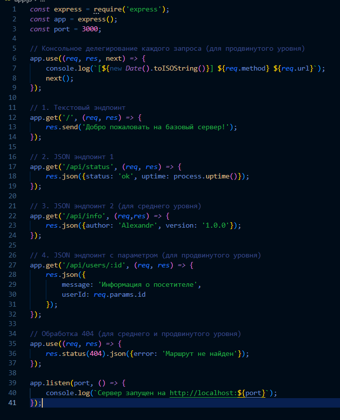

Был создан файл `package.json`.

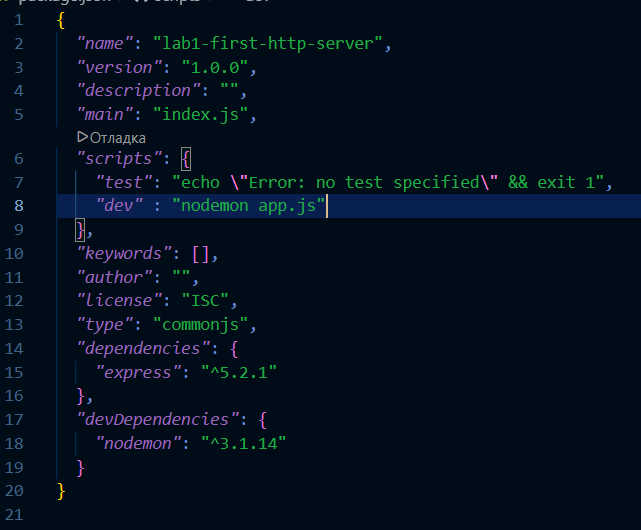

## Проверка работы практического примера

После запуска сервера были проверены следующие адреса:

```text
http://localhost:3000/
http://localhost:3000/api/status
http://localhost:3000/api/info
http://localhost:3000/api/users/5
http://localhost:3000/api/users/123
http://localhost:3000/api/users/ivan
http://localhost:3000/anything-else
```

### Скриншоты практического примера

Корневой маршрут:


JSON-эндпоинт:

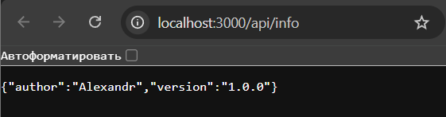

Эндпоинт с параметром:

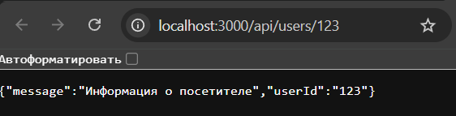

Страница 404:

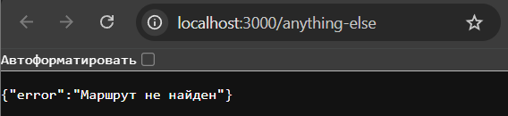

Логи:

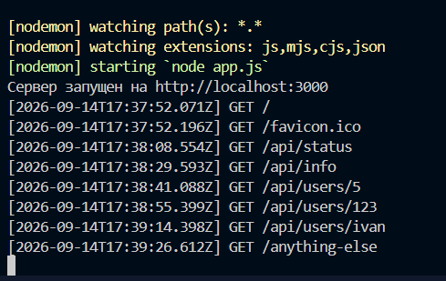

---

# Выполнение индивидуального задания

**Вариант: 9**

В ходе индивидуального задания были последовательно выполнены базовый, средний и повышенный уровни.

---

# Задание 1. Базовый уровень

Для базового уровня необходимо реализовать два эндпоинта:

- текстовый эндпоинт на корневом маршруте `/`;
- JSON-эндпоинт `/api/system`;
- настроить автоматический перезапуск сервера.

Для варианта №9 корневой маршрут должен возвращать строку:

```text
Привет из бэкенда
```

JSON-эндпоинт `/api/system` должен возвращать:

```json
{
    "os": "Linux",
    "arch": "x64"
}
```

## Код задания 1

```javascript
const express = require('express');

const app = express();
const port = 3000;

app.get('/', (req, res) => {
    res.send('Привет из бэкенда');
});

app.get('/api/system', (req, res) => {
    res.json({
        os: 'Linux',
        arch: 'x64'
    });
});

app.listen(port, () => {
    console.log(`Сервер запущен на http://localhost:${port}`);
});
```

## Проверка задания 1

Для проверки были использованы следующие адреса:

```text
http://localhost:3000/
http://localhost:3000/api/system
```

Результат запроса к `/`:

```text
Привет из бэкенда
```

Результат запроса к `/api/system`:

```json
{
    "os": "Linux",
    "arch": "x64"
}
```

### Скриншоты

Корневой маршрут:


JSON-эндпоинт:


## Проверка автоматического перезапуска

Сервер был запущен командой:

```bash
npm run dev
```

После изменения и сохранения файла `app.js` пакет `nodemon` автоматически перезапустил сервер без необходимости его ручной остановки и повторного запуска.

Сообщение в терминале:


---

# Задание 2. Средний уровень

Для среднего уровня необходимо реализовать:

- текстовый эндпоинт `/`;
- JSON-эндпоинт `/api/employees`;
- JSON-эндпоинт `/api/departments`;
- обработку ошибки 404;
- автоматический перезапуск сервера.

Для варианта №9 используются сущности сотрудников и отделов.

## Код задания 2

```javascript
const express = require('express');

const app = express();
const port = 3000;

app.get('/', (req, res) => {
    res.send('Привет из бэкенда');
});

app.get('/api/employees', (req, res) => {
    res.json([
        {
            id: 1,
            name: 'Иван Иванов',
            position: 'Developer'
        },
        {
            id: 2,
            name: 'Анна Петрова',
            position: 'Designer'
        },
        {
            id: 3,
            name: 'Алексей Смирнов',
            position: 'Manager'
        }
    ]);
});

app.get('/api/departments', (req, res) => {
    res.json([
        {
            id: 1,
            name: 'Development'
        },
        {
            id: 2,
            name: 'Design'
        },
        {
            id: 3,
            name: 'Management'
        }
    ]);
});

app.use((req, res) => {
    res.status(404).json({
        error: 'Not Found'
    });
});

app.listen(port, () => {
    console.log(`Сервер запущен на http://localhost:${port}`);
});
```

## Проверка задания 2

Для проверки были использованы следующие адреса:

```text
http://localhost:3000/
http://localhost:3000/api/employees
http://localhost:3000/api/departments
http://localhost:3000/hello
```

### Результат `/api/employees`

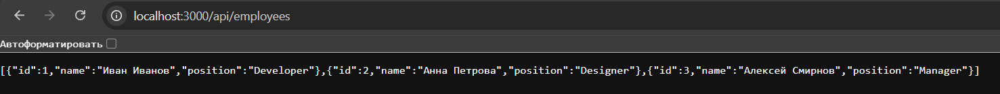

### Результат `/api/departments`

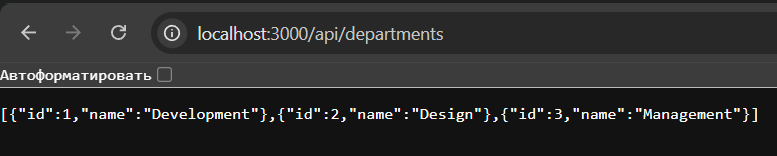

### Обработка ошибки 404

При обращении к несуществующему маршруту:

```text
http://localhost:3000/hello
```

сервер возвращает код состояния `404` и JSON:


Обработчик ошибки расположен после всех существующих маршрутов, поскольку Express выполняет проверку маршрутов сверху вниз.


---

# Задание 3. Повышенный уровень

Для повышенного уровня необходимо реализовать:

- один текстовый эндпоинт;
- два JSON-эндпоинта;
- эндпоинт с параметром в URL;
- обработку ошибки 404;
- автоматический перезапуск;
- консольное логирование всех входящих запросов.

Для варианта №9 используются следующие маршруты:

```text
/api/tickets
/api/events
/api/tickets/:id
```

## Код задания 3

```javascript
const express = require('express');

const app = express();
const port = 3000;

app.use((req, res, next) => {
    console.log(
        `[${new Date().toISOString()}] ${req.method} ${req.url}`
    );

    next();
});

app.get('/', (req, res) => {
    res.send('Привет из бэкенда');
});

app.get('/api/tickets', (req, res) => {
    res.json([
        {
            id: 1,
            event: 'Концерт',
            price: 1500
        },
        {
            id: 2,
            event: 'Футбольный матч',
            price: 2000
        },
        {
            id: 3,
            event: 'Театральная постановка',
            price: 1200
        }
    ]);
});

app.get('/api/events', (req, res) => {
    res.json([
        {
            id: 1,
            name: 'Концерт'
        },
        {
            id: 2,
            name: 'Футбольный матч'
        },
        {
            id: 3,
            name: 'Театральная постановка'
        }
    ]);
});

app.get('/api/tickets/:id', (req, res) => {
    res.json({
        requestedId: req.params.id,
        status: 'success'
    });
});

app.use((req, res) => {
    res.status(404).json({
        error: 'Not Found'
    });
});

app.listen(port, () => {
    console.log(`Сервер запущен на http://localhost:${port}`);
});
```

## Проверка задания 3

Были проверены следующие адреса:

```text
http://localhost:3000/
http://localhost:3000/api/tickets
http://localhost:3000/api/events
http://localhost:3000/api/tickets/5
http://localhost:3000/api/tickets/123
http://localhost:3000/hello
```

### Результат `/api/tickets`

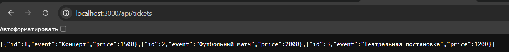
### Результат `/api/events`

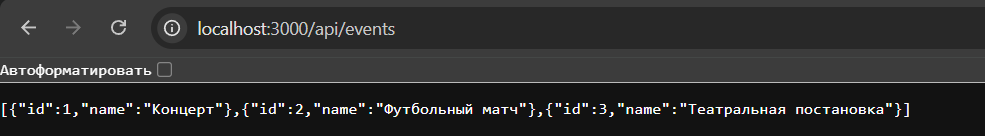
### Эндпоинт с параметром

При запросе:

```text
http://localhost:3000/api/tickets/5
```

сервер возвращает:

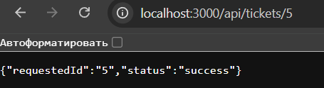

Параметр `:id` является изменяемой частью URL. Его значение в Express получается через:

```javascript
req.params.id
```

Например, при запросе:

```text
/api/tickets/123
```

значение `req.params.id` будет равно строке `"123"`.

### Обработка ошибки 404

При запросе к несуществующему адресу:

```text
http://localhost:3000/hello
```

сервер возвращает:


### Логирование запросов

Для логирования используется middleware:

```javascript
app.use((req, res, next) => {
    console.log(
        `[${new Date().toISOString()}] ${req.method} ${req.url}`
    );

    next();
});
```

При обращении к серверу в терминале отображается время запроса, HTTP-метод и URL:


Вызов:

```javascript
next();
```

передаёт запрос следующему обработчику Express.

---

# Ответы на контрольные вопросы

## 1. Что такое клиент-серверная архитектура?

Клиент-серверная архитектура - модель взаимодействия, в которой клиент отправляет запросы, а сервер принимает их, обрабатывает и возвращает ответы.

## 2. Какой протокол используется для общения клиента и сервера в вебе?

Для общения клиента и сервера в вебе используется протокол HTTP или его защищённая версия HTTPS.

## 3. Что такое эндпоинт (endpoint)?

Эндпоинт - это комбинация HTTP-метода и URL, по которой клиент обращается к определённому ресурсу или функции сервера. Например:

```text
GET /api/tickets
```

## 4. Какую структуру имеет HTTP-запрос и HTTP-ответ? Что такое код состояния (status code)?

HTTP-запрос содержит метод, URL, заголовки и при необходимости тело запроса. HTTP-ответ содержит код состояния, заголовки и тело ответа.

Код состояния — это числовой код, показывающий результат обработки запроса. Например, `200` означает успешный запрос, а `404` - отсутствие запрашиваемого ресурса.

## 5. Что такое JSON? Почему он популярен в веб-разработке?

JSON - текстовый формат представления структурированных данных на основе объектов, пар «ключ-значение» и массивов. Он популярен благодаря простому синтаксису, небольшому размеру и поддержке большинством языков программирования.

## 6. Как запустить сервер на Node.js или Flask?

Сервер на Node.js можно запустить командой:

```bash
node app.js
```

При использовании `nodemon`:

```bash
npm run dev
```

Сервер Flask запускается командой:

```bash
python app.py
```

## 7. Что такое автоматический перезапуск сервера и зачем он нужен? Какой пакет используется для Node.js?

Автоматический перезапуск сервера позволяет автоматически перезапускать приложение после изменения исходного кода. Это ускоряет разработку, так как сервер не требуется останавливать и запускать вручную после каждого изменения.

Для Node.js используется пакет `nodemon`.

## 8. Какие коды состояния HTTP вы знаете? За что отвечает код 404?

Некоторые распространённые коды состояния HTTP:

- `200 OK` - запрос успешно выполнен;
- `201 Created` - ресурс успешно создан;
- `400 Bad Request` - некорректный запрос;
- `401 Unauthorized` - требуется авторизация;
- `403 Forbidden` - доступ запрещён;
- `404 Not Found` - ресурс или маршрут не найден;
- `500 Internal Server Error` - внутренняя ошибка сервера.

Код `404` означает, что сервер не смог найти запрошенный ресурс или маршрут.

## 9. Что такое middleware в Express / декораторы запросов во Flask (для продвинутого уровня)?

Middleware в Express - промежуточная функция, которая выполняется во время обработки HTTP-запроса. Она получает объекты `req`, `res` и функцию `next`.

Middleware может использоваться, например, для логирования, авторизации или обработки данных.

Пример:

```javascript
app.use((req, res, next) => {
    console.log(req.method, req.url);
    next();
});
```

Функция `next()` передаёт запрос следующему обработчику.

## 10.Как получить параметр из URL-пути (например, ID пользователя) в вашем фреймворке?

В Express параметр задаётся в маршруте через двоеточие:

```javascript
app.get('/api/users/:id', (req, res) => {
    console.log(req.params.id);
});
```

Например, при запросе:

```text
/api/users/5
```

значение:

```javascript
req.params.id
```

будет равно:

```text
5
```

---

# Вывод

В ходе выполнения лабораторной работы была настроена среда разработки для создания серверных приложений на Node.js с использованием фреймворка Express. Был создан и запущен HTTP-сервер, обрабатывающий GET-запросы и возвращающий ответы как в текстовом формате, так и в формате JSON.

В ходе индивидуального задания были последовательно реализованы три уровня сложности. На базовом уровне были созданы текстовый и JSON-эндпоинты. На среднем уровне были добавлены несколько JSON-маршрутов и собственная обработка ошибки `404 Not Found`. На повышенном уровне был реализован параметризированный маршрут, позволяющий получать значение ID из URL, а также middleware для консольного логирования входящих запросов.

Также был изучен принцип автоматического перезапуска сервера с помощью пакета `nodemon`. В результате выполнения лабораторной работы были получены начальные практические навыки работы с клиент-серверной архитектурой, HTTP, маршрутизацией, JSON и Express.

Основной трудностью при выполнении работы было понимание последовательности обработки маршрутов Express и принципа работы параметров URL. В процессе выполнения стало понятно, что Express последовательно проверяет обработчики сверху вниз, поэтому обработчик ошибки 404 необходимо размещать после остальных маршрутов.

---

# Список использованных источников

1. **Node.js — официальная документация**  
   https://nodejs.org/en/docs/

2. **Express — официальная документация**  
   https://expressjs.com/

3. **MDN Web Docs — HTTP**  
   https://developer.mozilla.org/ru/docs/Web/HTTP

4. **MDN Web Docs — JSON**  
   https://developer.mozilla.org/ru/docs/Web/JavaScript/Reference/Global_Objects/JSON

5. **Nodemon — документация**  
   https://nodemon.io/

6. **Postman — документация**  
   https://learning.postman.com/docs/getting-started/introduction/