# Лабораторная работа №2  
## HTTP-методы: обработка GET, POST, PUT, DELETE

**Студент:** Власенко Александр Андреевич  
**Группа:** ПИЖ-б-о-25-1 
**Вариант:** 9  
**Уровень:** Продвинутый  
**Технология:** Node.js + Express  

---

## Содержание

- [Цель работы](#цель-работы)
- [Теоретическое обоснование](#теоретическое-обоснование)
- [Выполнение практического примера](#выполнение-практического-примера)
- [Выполнение индивидуального задания](#выполнение-индивидуального-задания)
- [Проверка работы API](#проверка-работы-api)
- [Ответы на контрольные вопросы](#ответы-на-контрольные-вопросы)
- [Вывод](#вывод)
- [Список использованных источников](#список-использованных-источников)

---

# Цель работы

Освоить обработку HTTP-методов `GET`, `POST`, `PUT` и `DELETE` в Express, научиться реализовывать CRUD-операции над коллекцией объектов, хранящейся в памяти сервера, а также использовать корректные HTTP-коды ответов.

Дополнительно для продвинутого уровня необходимо реализовать частичное обновление с помощью `PATCH`, массовые операции, дополнительные эндпоинты статистики и связанных элементов, логирование запросов в файл и глобальную обработку серверных ошибок.

---

# Теоретическое обоснование

CRUD - это набор четырёх базовых операций над данными: Create - создание, Read - чтение, Update - обновление и Delete - удаление. В HTTP этим операциям обычно соответствуют методы `POST`, `GET`, `PUT` или `PATCH` и `DELETE`. Метод `GET` используется для получения данных, `POST` - для создания нового ресурса, `PUT` - для полного обновления существующего ресурса, `PATCH` - для частичного обновления, а `DELETE` - для удаления.

HTTP-коды состояния позволяют клиенту понять результат выполнения запроса. Код `200 OK` означает успешное выполнение запроса, `201 Created` используется при успешном создании ресурса, `204 No Content` - при успешном выполнении операции без тела ответа, `400 Bad Request` - при некорректных данных запроса, `404 Not Found` - когда ресурс не найден, а `500 Internal Server Error` - при внутренней ошибке сервера.

В данной лабораторной работе база данных не используется. Все данные хранятся в массиве JavaScript в оперативной памяти процесса Node.js. Такой подход упрощает изучение CRUD-операций, однако данные теряются после перезапуска сервера и поэтому подобный способ хранения не подходит для реальных production-приложений.

---

# Выполнение практического примера

Для выполнения практического примера использовался проект на Node.js и Express.

## Подготовка проекта

Использовались следующие команды:

```bash
npm init -y
npm install express
npm install --save-dev nodemon
```

В файле `package.json` были настроены команды запуска:

```json
{
  "scripts": {
    "start": "node app.js",
    "dev": "nodemon app.js"
  }
}
```

Сервер запускался командой:

```bash
npm run dev
```

Практический пример из методических указаний реализует CRUD для коллекции `items`, хранящейся в памяти сервера.

## Код практического примера

```javascript
const express = require('express');

const app = express();
const port = 3000;

// Middleware для парсинга JSON
app.use(express.json());

// Middleware для логирования
app.use((req, res, next) => {
    console.log(`[${new Date().toISOString()}] ${req.method} ${req.url}`);
    next();
});

// Хранилище данных
let items = [
    { id: 1, name: 'Товар 1', price: 100, quantity: 5 },
    { id: 2, name: 'Товар 2', price: 200, quantity: 3 },
    { id: 3, name: 'Товар 3', price: 300, quantity: 10 }
];

let nextId = 4;

// Получить все элементы
app.get('/items', (req, res) => {
    res.json({
        count: items.length,
        items: items
    });
});

// Получить один элемент
app.get('/items/:id', (req, res) => {
    const id = parseInt(req.params.id);
    const item = items.find(i => i.id === id);

    if (!item) {
        return res.status(404).json({
            error: 'Элемент не найден'
        });
    }

    res.json(item);
});

// Создать новый элемент
app.post('/items', (req, res) => {
    const { name, price, quantity } = req.body;

    if (!name || price === undefined) {
        return res.status(400).json({
            error: 'Поля name и price обязательны'
        });
    }

    const newItem = {
        id: nextId++,
        name: name,
        price: price,
        quantity: quantity || 0
    };

    items.push(newItem);

    res.status(201).json(newItem);
});

// Обновить элемент
app.put('/items/:id', (req, res) => {
    const id = parseInt(req.params.id);
    const index = items.findIndex(i => i.id === id);

    if (index === -1) {
        return res.status(404).json({
            error: 'Элемент не найден'
        });
    }

    const { name, price, quantity } = req.body;

    items[index] = {
        id: id,
        name: name || items[index].name,
        price: price !== undefined ? price : items[index].price,
        quantity: quantity !== undefined ? quantity : items[index].quantity
    };

    res.json(items[index]);
});

// Удалить элемент
app.delete('/items/:id', (req, res) => {
    const id = parseInt(req.params.id);
    const index = items.findIndex(i => i.id === id);

    if (index === -1) {
        return res.status(404).json({
            error: 'Элемент не найден'
        });
    }

    const deletedItem = items.splice(index, 1)[0];

    res.json({
        message: 'Элемент удалён',
        deleted: deletedItem
    });
});

// Обработка 404
app.use((req, res) => {
    res.status(404).json({
        error: 'Маршрут не найден'
    });
});

app.listen(port, () => {
    console.log(`Сервер запущен на http://localhost:${port}`);
});
```

Практический пример содержит получение коллекции и отдельного элемента, создание, полное обновление, удаление и обработку ошибки `404`.

## Проверка практического примера

Для проверки использовался Postman.

Проверялись запросы:

```text
GET    http://localhost:3000/items
GET    http://localhost:3000/items/2
POST   http://localhost:3000/items
PUT    http://localhost:3000/items/1
DELETE http://localhost:3000/items/3
```

При выполнении POST в теле запроса передавался JSON:

```json
{
    "name": "Новый товар",
    "price": 500,
    "quantity": 7
}
```

При успешном создании сервер возвращал код:

```text
201 Created
```

При PUT-запросе передавалось новое состояние ресурса, а при DELETE удалялся выбранный элемент. Такие запросы и ожидаемые ответы приведены в методических указаниях.

### Скриншоты практического примера

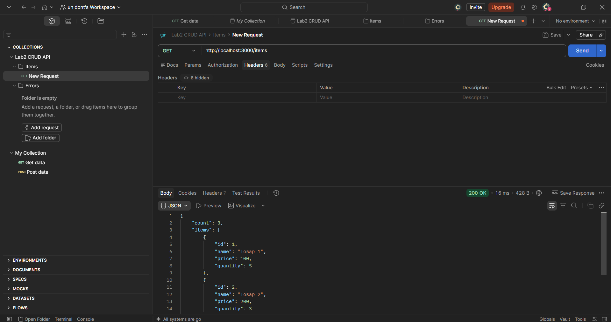

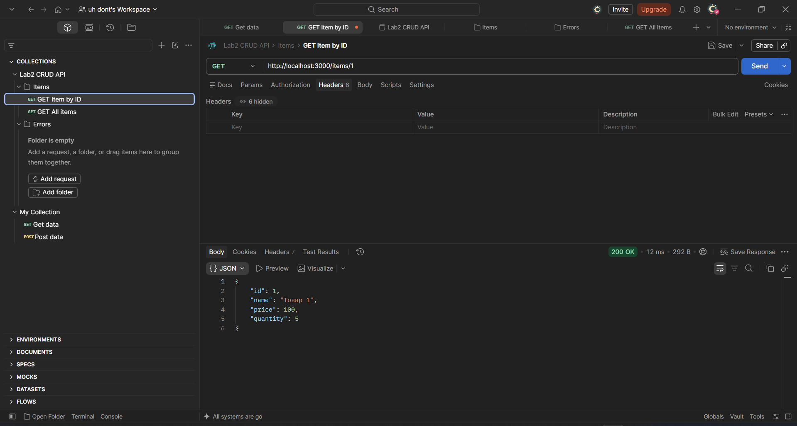

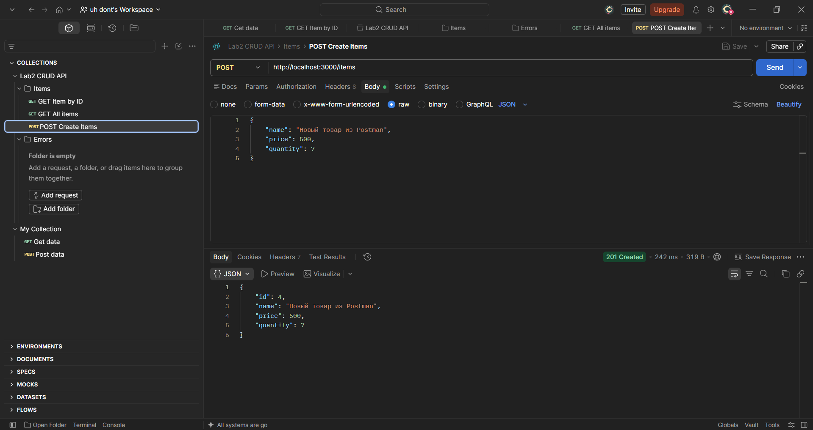

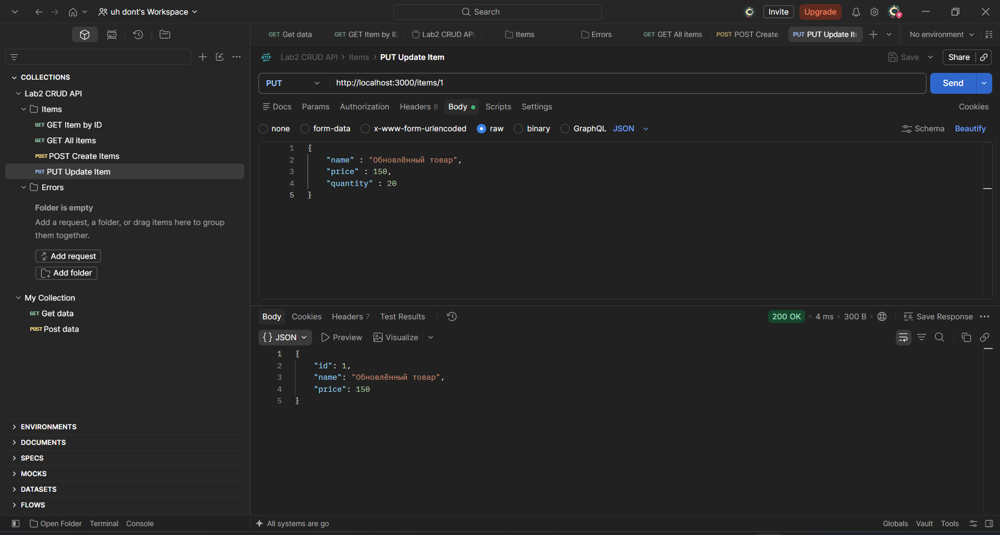

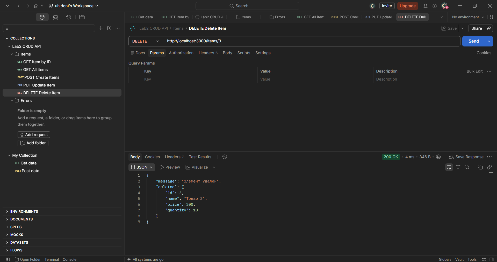

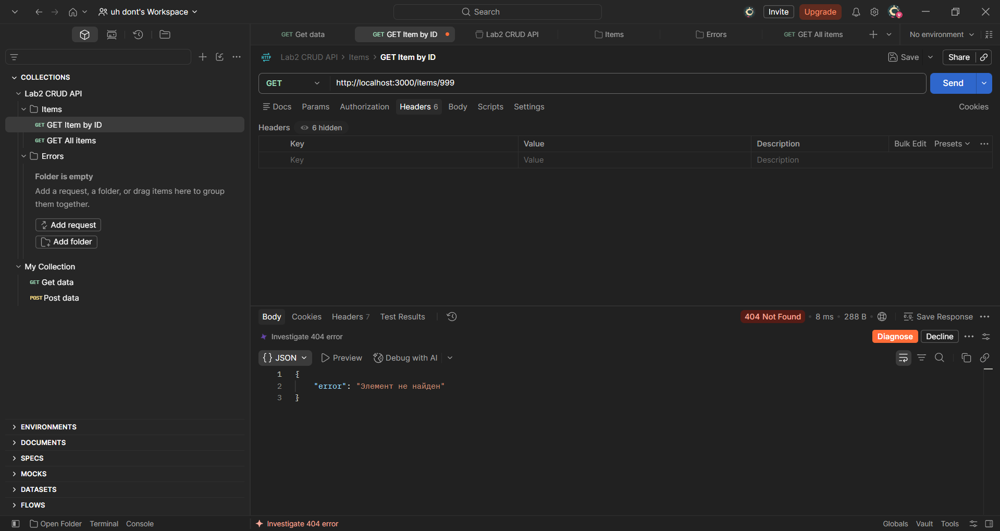

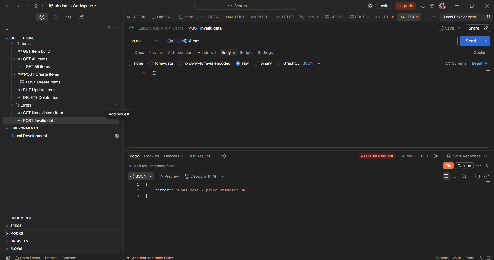

Также для удобства была создана переменная окружения с базовым URL сервера.

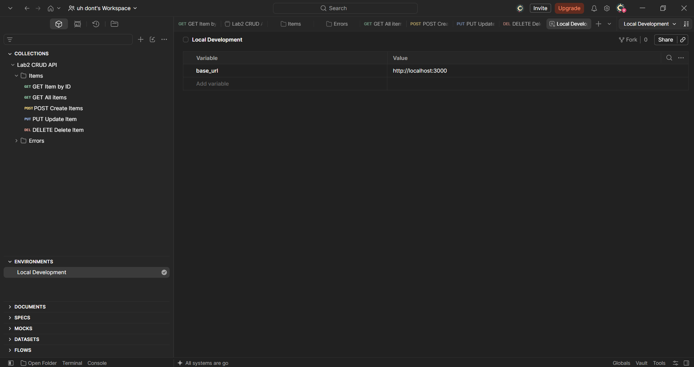

Были написаны и пройдены тесты.

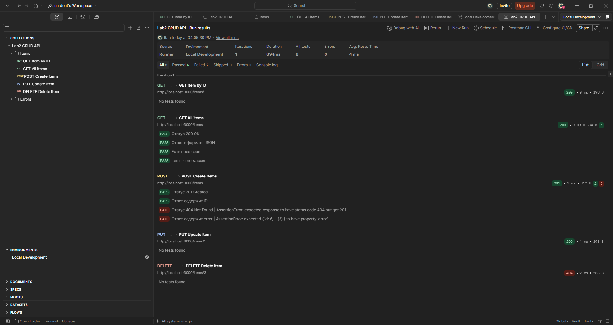

---

# Выполнение индивидуального задания

**Вариант:** 9  
**Сущность:** Курсы (`courses`)  
**Уровень:** Продвинутый

Для варианта №9 используются поля:

```text
id
title
duration
level
price
```

Поиск выполняется по полю `title`.

Для продвинутого уровня статистика должна отображать количество курсов по уровням, а связанные элементы определяются по одинаковому значению поля `level`.

Продвинутый уровень также включает частичное обновление `PATCH`, массовое удаление, массовое создание, статистику, получение связанных элементов, логирование запросов в файл и глобальный обработчик ошибок.

## Итоговый код сервера

```javascript
const express = require("express");
const fs = require("fs");

const app = express();
const port = 3000;

app.use(express.json());

app.use((req, res, next) => {
  const log = `[${new Date().toISOString()}] ${req.method} ${req.url}\n`;

  console.log(log.trim());

  fs.appendFile("access.log", log, (err) => {
    if (err) {
      console.error("Ошибка записи лога:", err);
    }
  });

  next();
});

let courses = [
  {
    id: 1,
    title: "backend-разработка",
    duration: 164,
    level: "beginner",
    price: 90000,
  },
  {
    id: 2,
    title: "frontend-разработка",
    duration: 135,
    level: "beginner",
    price: 120000,
  },
  {
    id: 3,
    title: "мобильная разработка",
    duration: 220,
    level: "advanced",
    price: 150000,
  },
];

let nextId = 4;

app.get("/courses", (req, res) => {
  if (req.query.search) {
    const searchedName = req.query.search.toLowerCase();

    const result = courses.filter((course) =>
      course.title.toLowerCase().includes(searchedName),
    );

    return res.json({
      message: "результаты поиска",
      items: result,
    });
  }

  if (req.query.sort) {
    let result = [...courses];

    const sortField = req.query.sort;
    const order = req.query.order || "asc";

    result.sort((a, b) => {
      if (typeof a[sortField] === "number") {
        return order === "desc"
          ? b[sortField] - a[sortField]
          : a[sortField] - b[sortField];
      }

      return order === "desc"
        ? String(b[sortField]).localeCompare(String(a[sortField]))
        : String(a[sortField]).localeCompare(String(b[sortField]));
    });

    return res.json({
      message: "успешная сортировка",
      items: result,
    });
  }

  if (req.query.page) {
    let result = [...courses];

    const page = parseInt(req.query.page) || 1;
    const limit = parseInt(req.query.limit) || result.length;

    const startIndex = (page - 1) * limit;
    const endIndex = startIndex + limit;

    const paginatedCourses = result.slice(startIndex, endIndex);

    return res.json({
      page: page,
      limit: limit,
      total: result.length,
      items: paginatedCourses,
    });
  }

  return res.json({
    count: courses.length,
    items: courses,
  });
});

app.get("/courses/stats", (req, res) => {
  const stats = {};

  courses.forEach(course => {
    if (stats[course.level] === undefined) {
      stats[course.level] = 1;
    } else {
      stats[course.level]++;
    }
  });

  res.json(stats);
});

app.get("/courses/:id", (req, res) => {
  const id = parseInt(req.params.id);
  const item = courses.find((i) => i.id === id);

  if (!item) {
    return res.status(404).json({
      error: "Такого курса не существует"
    });
  }

  res.json(item);
});

app.get("/courses/:id/related", (req, res) => {
  const id = parseInt(req.params.id);
  const item = courses.find((i) => i.id === id);

  if (!item) {
    return res.status(404).json({
      error: "Такого курса не существует"
    });
  }

  const level = item.level;

  const relatedCourses = courses.filter((i) => {
    return i.level === level && i.id !== id;
  });

  res.json({
    related_count: relatedCourses.length,
    related: relatedCourses,
  });
});

app.post("/courses", (req, res) => {
  const { title, duration, level, price } = req.body;

  if (!title || duration === undefined || !level || price === undefined) {
    return res.status(400).json({
      error: "Обязательные поля не заполнены"
    });
  }

  if (
    typeof title !== "string" ||
    Number.isFinite(duration) === false ||
    duration <= 0 ||
    typeof level !== "string" ||
    Number.isFinite(price) === false ||
    price <= 0
  ) {
    return res.status(400).json({
      error: "Неверный тип данных или недопустимый диапазон данных"
    });
  }

  const newItem = {
    id: nextId++,
    title,
    duration,
    level,
    price
  };

  courses.push(newItem);

  res.status(201).json(newItem);
});

app.post("/courses/bulk", (req, res) => {
  if (!Array.isArray(req.body)) {
    return res.status(400).json({
      error: "Ожидается массив объектов",
    });
  }

  const newCourses = [];

  for (let i = 0; i < req.body.length; i++) {
    const { title, duration, level, price } = req.body[i];

    if (!title || duration === undefined || !level || price === undefined) {
      return res.status(400).json({
        error: "Обязательные поля не заполнены"
      });
    }

    if (
      typeof title !== "string" ||
      Number.isFinite(duration) === false ||
      duration <= 0 ||
      typeof level !== "string" ||
      Number.isFinite(price) === false ||
      price <= 0
    ) {
      return res.status(400).json({
        error: "Неверный тип данных или недопустимый диапазон данных",
      });
    }

    const newItem = {
      id: nextId++,
      title,
      duration,
      level,
      price
    };

    newCourses.push(newItem);
  }

  courses.push(...newCourses);

  res.status(201).json(newCourses);
});

app.put("/courses/:id", (req, res) => {
  const id = parseInt(req.params.id);
  const index = courses.findIndex((i) => i.id === id);

  if (index === -1) {
    return res.status(404).json({
      error: "Такого курса не существует"
    });
  }

  const { title, duration, level, price } = req.body;

  if (!title || duration === undefined || !level || price === undefined) {
    return res.status(400).json({
      error: "Обязательные поля не заполнены"
    });
  }

  if (
    typeof title !== "string" ||
    Number.isFinite(duration) === false ||
    duration <= 0 ||
    typeof level !== "string" ||
    Number.isFinite(price) === false ||
    price <= 0
  ) {
    return res.status(400).json({
      error: "Неверный тип данных или недопустимый диапазон данных"
    });
  }

  courses[index] = {
    id,
    title,
    duration,
    level,
    price,
  };

  res.status(200).json(courses[index]);
});

app.patch("/courses/:id", (req, res) => {
  const id = parseInt(req.params.id);
  const index = courses.findIndex((i) => i.id === id);

  if (index === -1) {
    return res.status(404).json({
      error: "Такого курса не существует"
    });
  }

  const { title, duration, level, price } = req.body;

  if (
    (title !== undefined && typeof title !== "string") ||
    (duration !== undefined &&
      (Number.isFinite(duration) === false || duration <= 0)) ||
    (level !== undefined && typeof level !== "string") ||
    (price !== undefined &&
      (Number.isFinite(price) === false || price <= 0))
  ) {
    return res.status(400).json({
      error: "Неверный тип данных или недопустимый диапазон данных"
    });
  }

  courses[index] = {
    id,
    title: title ?? courses[index].title,
    duration: duration ?? courses[index].duration,
    level: level ?? courses[index].level,
    price: price ?? courses[index].price,
  };

  res.status(200).json(courses[index]);
});

app.delete("/courses", (req, res) => {
  courses.length = 0;

  res.status(204).send();
});

app.delete("/courses/:id", (req, res) => {
  const id = parseInt(req.params.id);
  const index = courses.findIndex((i) => i.id === id);

  if (index === -1) {
    return res.status(404).json({
      error: "Такого курса не существует"
    });
  }

  courses.splice(index, 1);

  res.status(204).send();
});

app.use((req, res) => {
  res.status(404).json({
    error: "Такого маршрута не существует"
  });
});

app.use((err, req, res, next) => {
  console.error(err);

  res.status(500).json({
    error: "Внутренняя ошибка сервера",
  });
});

app.listen(port, () => {
  console.log(`Сервер запущен на http://localhost:${port}`);
});
```

---

# Проверка работы API

Для проверки использовался Postman.

Postman позволяет отправлять запросы различных HTTP-методов, задавать URL, query-параметры, заголовки и тело запроса, а также просматривать тело ответа и HTTP-код.

## Получение всех курсов

```text
GET http://localhost:3000/courses
```

Пример ответа:

```json
{
  "count": 3,
  "items": [
    {
      "id": 1,
      "title": "backend-разработка",
      "duration": 164,
      "level": "beginner",
      "price": 90000
    }
  ]
}
```

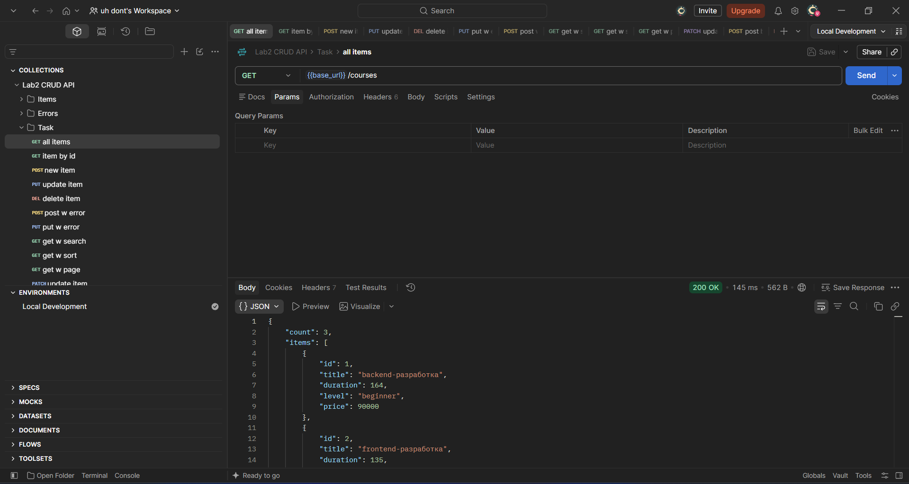

---

## Получение курса по ID

```text
GET http://localhost:3000/courses/2
```

Пример ответа:

```json
{
    "id": 2,
    "title": "frontend-разработка",
    "duration": 135,
    "level": "beginner",
    "price": 120000
}
```

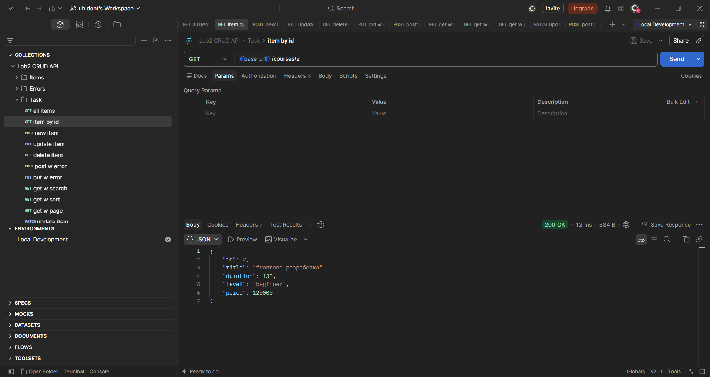

---

## Поиск по названию

```text
GET http://localhost:3000/courses?search=backend
```

Поиск реализован с использованием метода `filter()` и `includes()`.

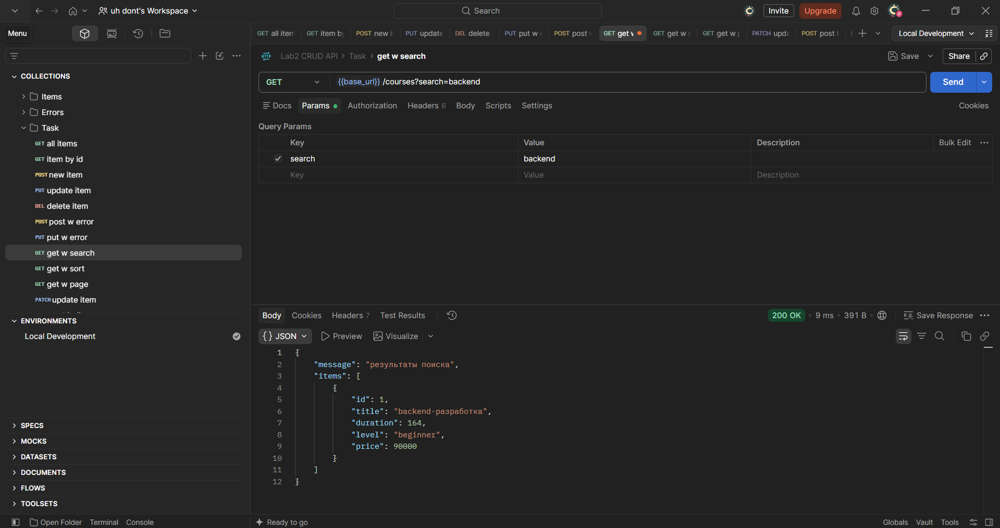

---

## Сортировка

Например:

```text
GET http://localhost:3000/courses?sort=price&order=asc
```

или:

```text
GET http://localhost:3000/courses?sort=price&order=desc
```

`asc` используется для сортировки по возрастанию, `desc` - по убыванию.

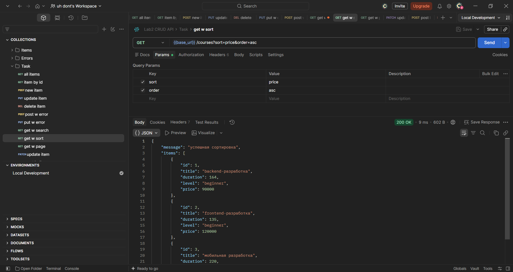


---

## Пагинация

```text
GET http://localhost:3000/courses?page=1&limit=2
```

Параметр `page` задаёт номер страницы, а `limit` - максимальное количество элементов на странице.

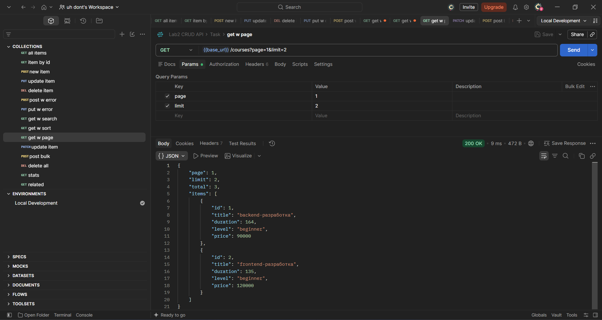

---

## Создание курса

```text
POST http://localhost:3000/courses
```

Тело запроса:

```json
{
  "title": "DevOps",
  "duration": 188,
  "level": "intermediate",
  "price": 80000
}
```

При успешном создании возвращается:

```text
201 Created
```

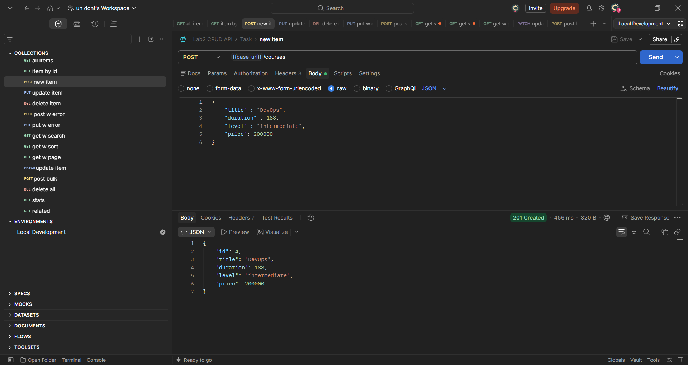

---

## Проверка ошибки валидации

Например:

```json
{
  "title": "DevOps",
  "duration": -5,
  "level": "intermediate",
  "price": 80000
}
```

Или:
```json
{
    "title": "blockchain-разработка",
    "duration" : 23,
    "level": "intermediate",
    "price": "230000"
}
```

Сервер возвращает:

```text
400 Bad Request
```

и JSON:

```json
{
  "error": "Неверный тип данных или недопустимый диапазон данных"
}
```

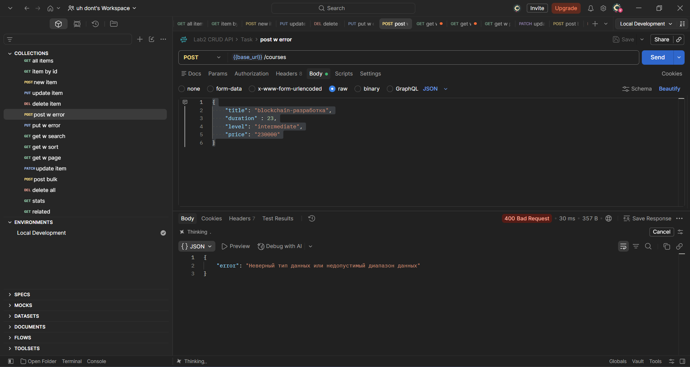

---

## Полное обновление PUT

```text
PUT http://localhost:3000/courses/1
```

Тело запроса:

```json
{
    "title" : "машинное обучение",
    "duration": 450,
    "level": "professional",
    "price": 300000
}
```

При успешном обновлении возвращается:

```text
200 OK
```

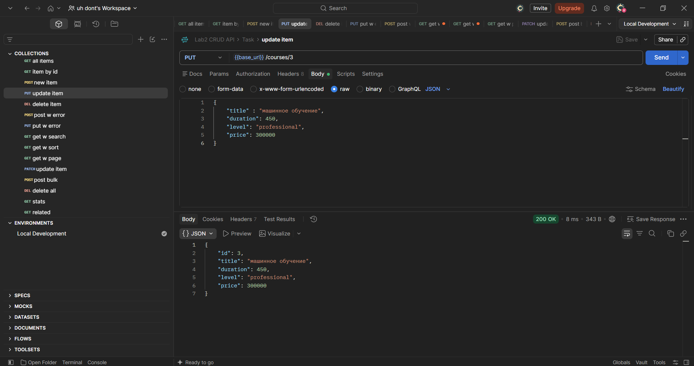

При незаполнении всех полей возвращается ошибка с кодом 400:

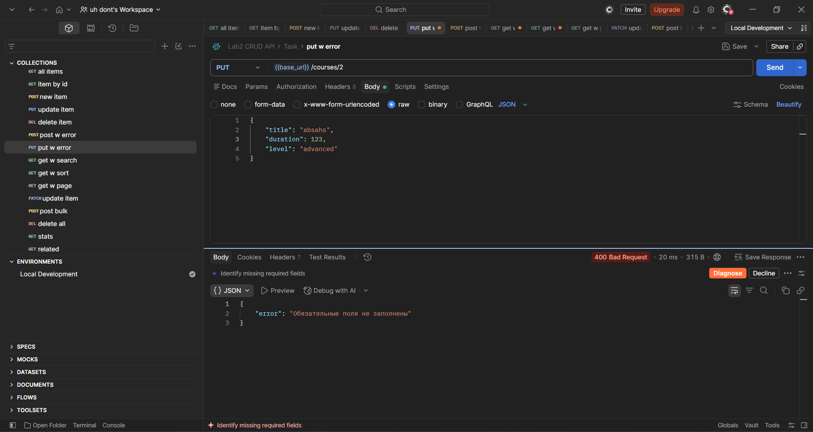

---

## Частичное обновление PATCH

```text
PATCH http://localhost:3000/courses/1
```

Тело запроса может содержать только изменяемые поля:

```json
{
    "level": "professional",
    "duration": 554,
    "price": 220000
}
```

При этом остальные свойства курса остаются без изменений.

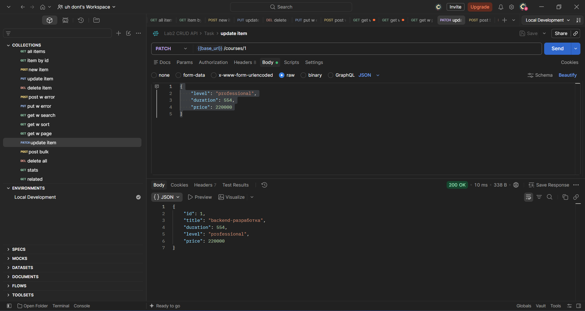

---

## Массовое создание

```text
POST http://localhost:3000/courses/bulk
```

Тело запроса:

```json
[
    {
        "title": "C++ разработка",
        "duration": 777,
        "level": "professional",
        "price": 340000
    },
    {
        "title": "Java-разработка",
        "duration": 650,
        "level": "intermediate",
        "price": 310000
    }
]
```

Каждому созданному элементу сервер назначает уникальный ID.

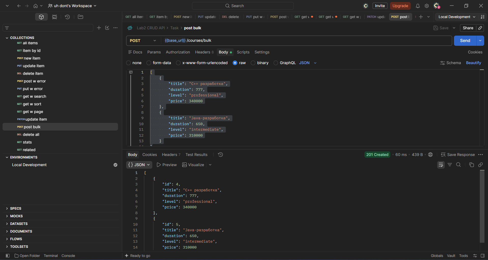

---

## Получение статистики

```text
GET http://localhost:3000/courses/stats
```

Статистика формируется динамически по значениям поля `level`.

Пример:

```json
{
  "beginner": 2,
  "advanced": 1
}
```

Это соответствует условию варианта №9: получение количества курсов по уровням.

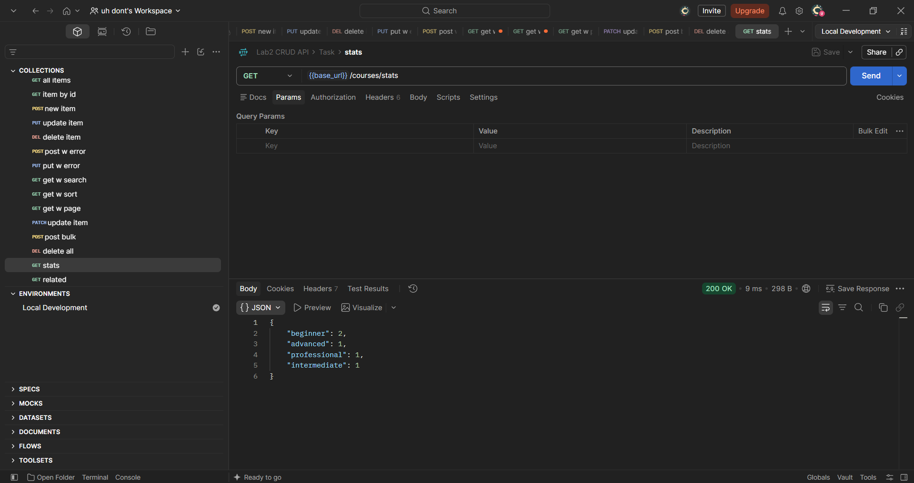

---

## Получение связанных курсов

```text
GET http://localhost:3000/courses/1/related
```

Сервер сначала определяет уровень выбранного курса, после чего возвращает другие курсы с таким же уровнем.

Пример:

```json
{
  "related_count": 1,
  "related": [
    {
      "id": 2,
      "title": "frontend-разработка",
      "duration": 135,
      "level": "beginner",
      "price": 120000
    }
  ]
}
```

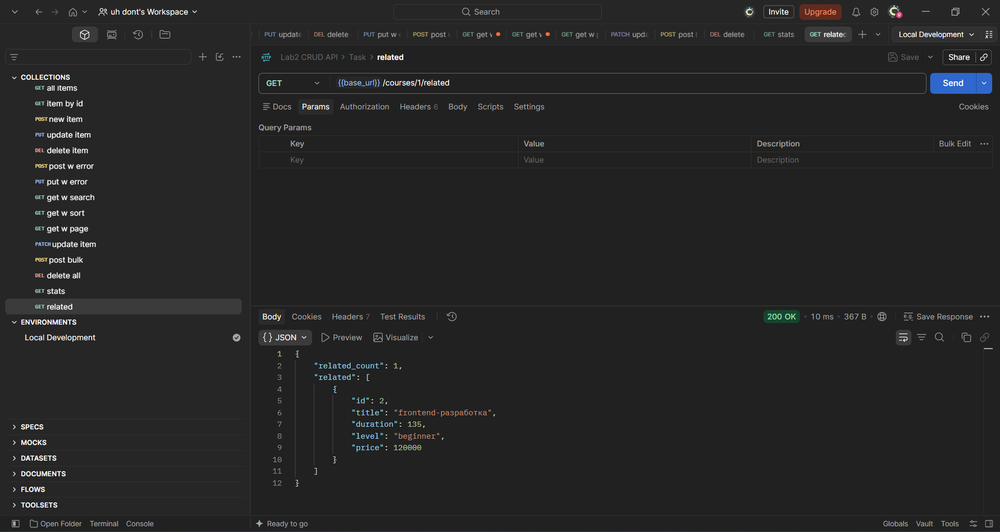

---

## Удаление одного курса

```text
DELETE http://localhost:3000/courses/1
```

При успешном удалении сервер возвращает:

```text
204 No Content
```

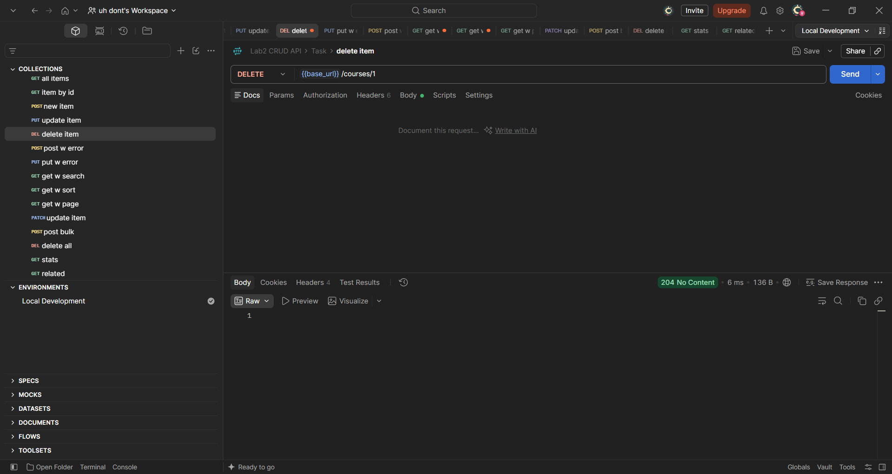

---

## Массовое удаление

```text
DELETE http://localhost:3000/courses
```

Операция очищает всю коллекцию:

```javascript
courses.length = 0;
```

При успешном выполнении сервер возвращает:

```text
204 No Content
```

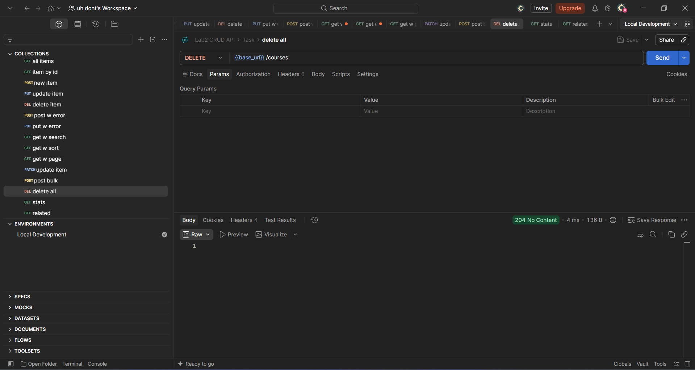

---

## Ошибка 404

При запросе несуществующего курса:

```text
GET http://localhost:3000/courses/999
```

сервер возвращает:

```text
404 Not Found
```

```json
{
  "error": "Такого курса не существует"
}
```

При обращении к несуществующему маршруту сервер также возвращает `404`.

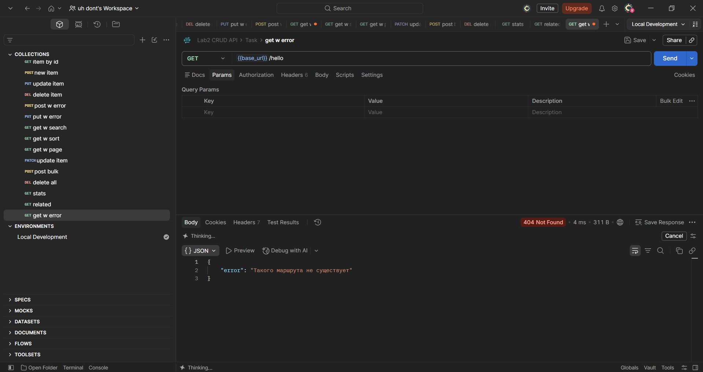

---

## Глобальная обработка ошибки 500

В приложении реализовано специальное middleware:

```javascript
app.use((err, req, res, next) => {
  console.error(err);

  res.status(500).json({
    error: "Внутренняя ошибка сервера",
  });
});
```

Оно предназначено для обработки непредвиденных серверных ошибок и возврата:

```text
500 Internal Server Error
```

Пример ответа:

```json
{
  "error": "Внутренняя ошибка сервера"
}
```

Для тестирования ошибки 500 была добавлена временная строка в код:
```javascript
app.get('/test-500', (req, res) => { throw new Error('Test 500'); });
```

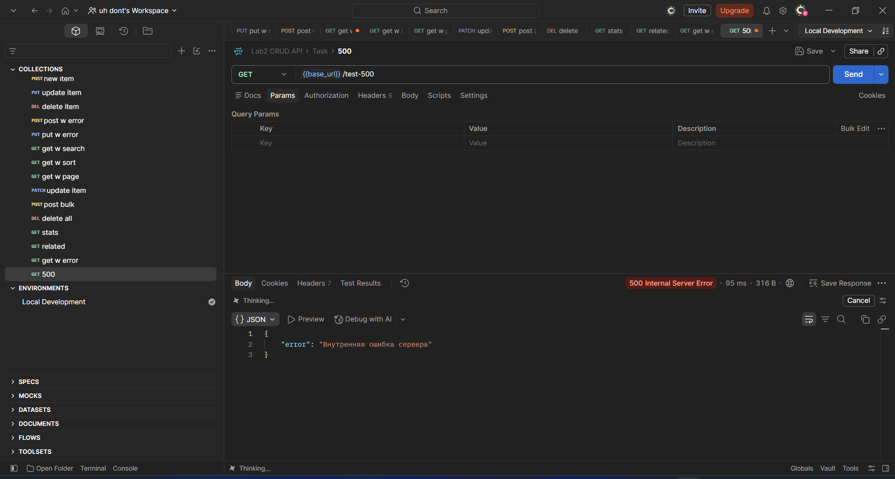

---

## Логирование запросов

Для записи запросов используется встроенный модуль Node.js `fs`.

```javascript
fs.appendFile("access.log", log, (err) => {
  if (err) {
    console.error("Ошибка записи лога:", err);
  }
});
```

Каждый входящий запрос записывается в файл `access.log`.

Пример:

```text
[2026-09-23T18:10:15.216Z] GET /courses
[2026-09-23T18:10:22.341Z] POST /courses
[2026-09-23T18:10:28.912Z] PATCH /courses/1
[2026-09-23T18:10:34.175Z] DELETE /courses/2
```

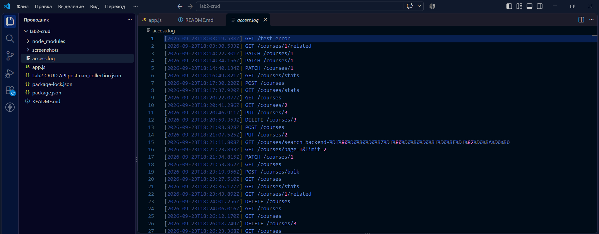

---

# Ответы на контрольные вопросы

## 1. Как реализовать частичное обновление (PATCH)?

Частичное обновление реализуется через маршрут `PATCH /items/:id`. Сервер находит ресурс по ID и изменяет только те поля, которые были переданы в `req.body`, сохраняя остальные значения без изменений.

---

## 2. Как реализовать массовое удаление элементов?

Необходимо создать DELETE-эндпоинт для всей коллекции и очистить массив. Например:

```javascript
courses.length = 0;
```

После операции можно вернуть статус `204 No Content`.

---

## 3. Как реализовать массовое создание элементов?

Необходимо принять в `req.body` массив объектов, проверить каждый элемент, назначить каждому новый уникальный ID и добавить созданные объекты в основную коллекцию. При успешном создании используется статус `201 Created`.

---

## 4. Как реализовать глобальный обработчик ошибок?

В Express используется специальное error-handling middleware с четырьмя параметрами:

```javascript
(err, req, res, next)
```

Например:

```javascript
app.use((err, req, res, next) => {
    console.error(err);

    res.status(500).json({
        error: "Внутренняя ошибка сервера"
    });
});
```

---

## 5. Как логировать запросы в файл?

Можно создать middleware, которое формирует строку с датой, методом и URL запроса, а затем записывает её в файл с помощью встроенного модуля Node.js `fs`.

Например:

```javascript
fs.appendFile("access.log", log, callback);
```

---

## 6. Что такое REST API и какие принципы лежат в его основе?

REST API - подход к организации взаимодействия между клиентом и сервером через ресурсы и стандартные HTTP-методы. Основные принципы включают разделение клиента и сервера, отсутствие хранения состояния клиента между запросами, единообразный интерфейс, использование URL для ресурсов, HTTP-методов и стандартных кодов состояния.

---

## 7. Как организовать структуру проекта для масштабируемого CRUD API?

При увеличении проекта код обычно разделяют на маршруты, контроллеры, модели или слой данных, middleware, сервисы и конфигурацию. Это позволяет не хранить всю логику приложения в одном файле `app.js`.

---

## 8. Какие существуют стратегии генерации уникальных ID?

Можно использовать увеличивающийся числовой счётчик, определять максимальный существующий ID и увеличивать его, использовать UUID или передавать генерацию ID базе данных. В данной лабораторной используется счётчик `nextId`.

---

## 9. Как защитить API от слишком больших запросов?

Следует ограничивать максимально допустимый размер тела запроса. В Express ограничение можно настроить при использовании `express.json()`. Слишком большие запросы должны отклоняться сервером.

---

## 10.Как реализовать связь между сущностями (например, задачи и пользователи)?

Обычно одна сущность хранит идентификатор связанной сущности, например задача может содержать `userId`. Сервер может использовать этот идентификатор для поиска связанных объектов. В данной работе связь между курсами определяется одинаковым значением поля `level`.

---

# Вывод

В ходе выполнения лабораторной работы были изучены основные HTTP-методы и принципы построения CRUD API на Node.js с использованием Express. Был создан сервер, поддерживающий получение, создание, полное обновление и удаление ресурсов.

Для индивидуального задания варианта №9 был реализован API для работы с курсами. Для каждого курса используются поля `id`, `title`, `duration`, `level` и `price`. Были реализованы получение всей коллекции и отдельного курса, создание, обновление и удаление курсов.

Дополнительно были реализованы функции среднего и продвинутого уровней: поиск по названию, сортировка, пагинация, валидация входных данных, частичное обновление через `PATCH`, массовое создание и удаление элементов, получение статистики по уровням и поиск связанных курсов.

Для логирования всех входящих HTTP-запросов был использован встроенный модуль Node.js `fs`, с помощью которого данные записываются в файл `access.log`. Также был реализован глобальный обработчик внутренних ошибок сервера с кодом `500`.

В процессе выполнения работы были изучены объекты `req.params`, `req.query` и `req.body`, методы массивов `find`, `findIndex`, `filter`, `sort`, `slice`, `forEach`, `push` и `splice`, а также особенности использования HTTP-кодов `200`, `201`, `204`, `400`, `404` и `500`.

Основными трудностями при выполнении работы стали организация сортировки и пагинации через query-параметры, правильное завершение обработчиков после отправки HTTP-ответа, реализация частичного обновления и массового создания элементов. В результате выполнения лабораторной работы было сформировано более полное понимание работы REST-подобного API и взаимодействия клиента с сервером через HTTP.

---

# Список использованных источников

1. **Express — Routing**  
   https://expressjs.com/en/guide/routing.html

2. **Express — Request и Response**  
   https://expressjs.com/en/4x/api.html

3. **MDN — HTTP Methods**  
   https://developer.mozilla.org/ru/docs/Web/HTTP/Methods

4. **MDN — HTTP Status Codes**  
   https://developer.mozilla.org/ru/docs/Web/HTTP/Status

5. **REST API Tutorial**  
   https://restfulapi.net/

6. **Postman Learning Center**  
   https://learning.postman.com/

7. **Node.js File System (`fs`)**  
   https://nodejs.org/api/fs.html